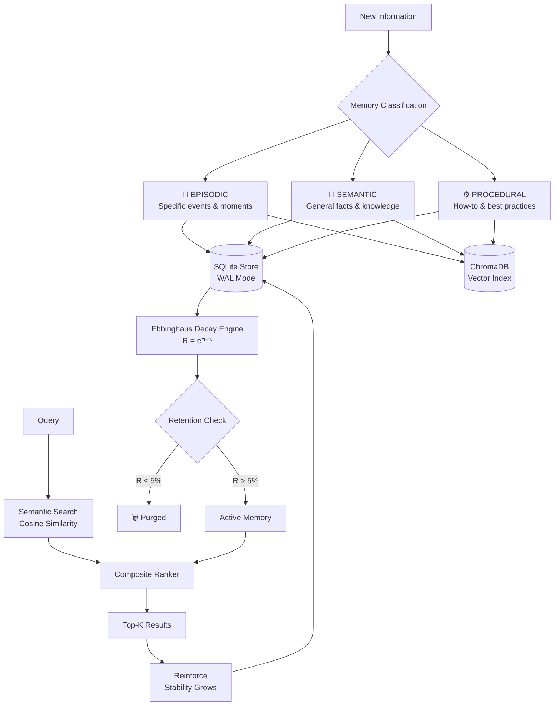
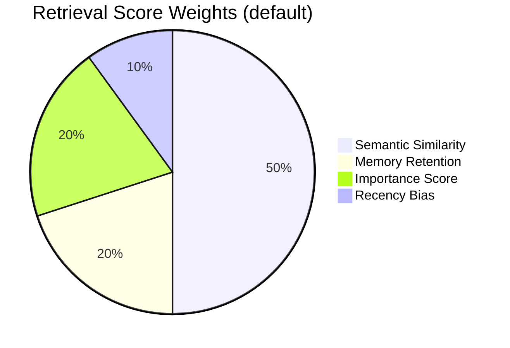
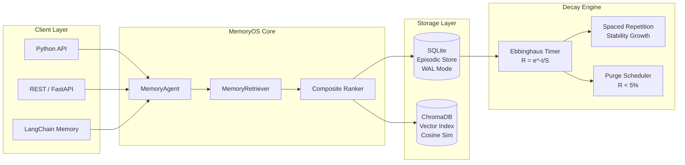
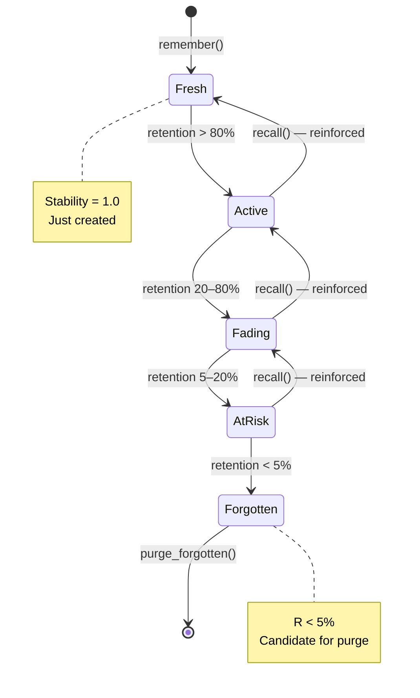
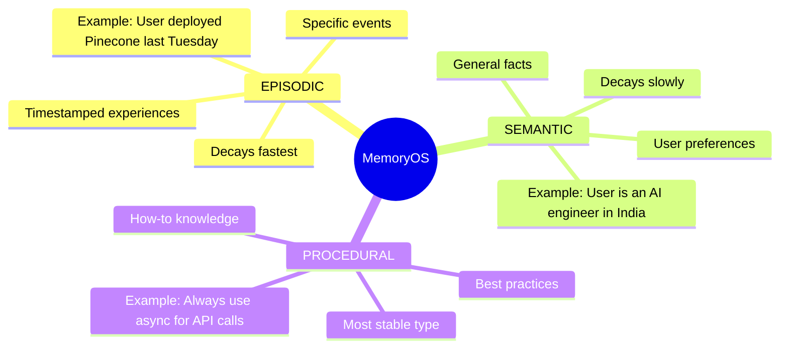
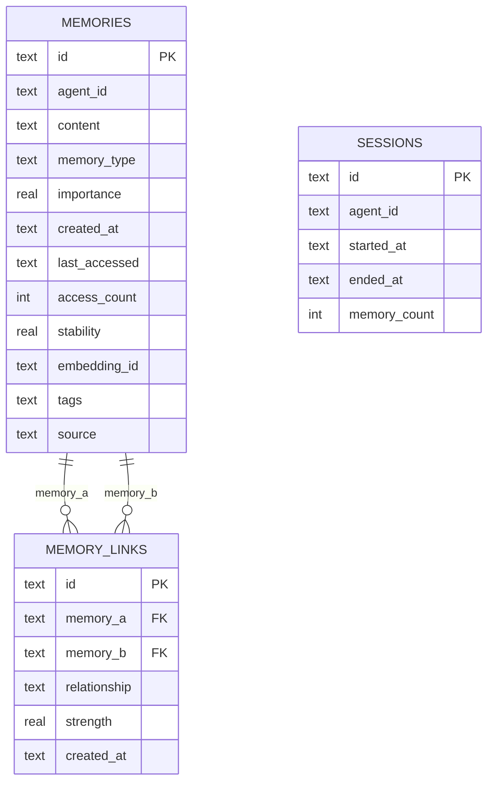
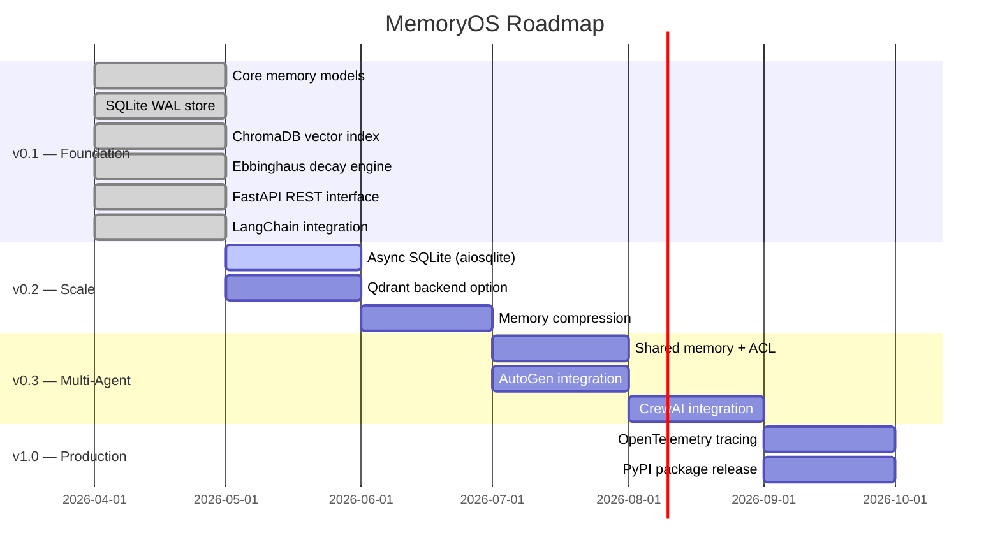

<div align="center">

# 🧠 MemoryOS

### *The memory layer your AI agents were missing.*

**Persistent · Decaying · Semantically ranked · Reinforced on recall**

[](https://github.com/MAYANK12-WQ/memoryos/actions)
[](https://www.python.org/)
[](LICENSE)
[](https://www.trychroma.com/)
[](https://fastapi.tiangolo.com/)
[](https://langchain.com/)

<br/>

> Most AI agents start every session from zero.  
> MemoryOS gives them a real memory — one that **persists**, retrieves what's **relevant**, and **forgets** low-value noise using the same mathematics as human long-term memory.

<br/>

</div>

---

## The Problem with Agent Memory Today

| Approach | Fatal Flaw |
|---|---|
| `ConversationBufferMemory` | Floods context window. Forgets nothing. Crashes on long sessions. |
| `ConversationSummaryMemory` | Lossy compression. Nuance is destroyed. |
| Plain `VectorStoreRetriever` | Time-blind. A 3-month-old fact scores the same as yesterday's critical event. |
| **MemoryOS** | ✅ Persistent across restarts. Decays intelligently. Reinforced on recall. |

---

## How It Works



---

## The Ebbinghaus Forgetting Curve

> *"Without conscious effort to retain it, knowledge fades — predictably."* — Hermann Ebbinghaus, 1885

MemoryOS implements the forgetting curve formula as a live production algorithm:

```
R = e^(-t / S)

R = Retention (0.0 → 1.0)
t = Time since last access (days)
S = Stability (grows with each recall via spaced repetition)
```

```
Retention
  1.0 │▓▓▓╮
      │    ╲  S=1.0 (never recalled)
  0.8 │     ╲
      │      ╲        S=2.0 (recalled once)
  0.6 │       ╲     ╭──────╮
      │        ╲   ╱        ╲
  0.4 │         ╲ ╱          ╲   S=5.0 (recalled 4x)
      │          ╳            ╲╭─────────────────────
  0.2 │         ╱ ╲            ╲
      │        ╱   ╲____________╲____________________
  0.0 └─────────────────────────────────────────────▶
      0    1    2    3    4    5    6    7   days
```

| Stability | 1 day | 3 days | 7 days | 30 days |
|---|---|---|---|---|
| S=1.0 (never recalled) | 37% | 5% | <1% | ~0% |
| S=2.0 (recalled once) | 61% | 22% | 3% | ~0% |
| S=5.0 (recalled 4×) | 82% | 55% | 25% | 0.2% |
| S=15.0 (deeply learned) | 94% | 82% | 63% | 13% |

**Spaced Repetition Effect:** Each recall increases stability logarithmically — early recalls give big gains, later ones give diminishing returns. Exactly like human memory.

---

## Composite Retrieval Score

MemoryOS doesn't just return the most semantically similar result. It ranks by a weighted composite:



```
score = 0.50 × cosine_similarity    (ChromaDB vector search)
      + 0.20 × retention            (Ebbinghaus R = e^(-t/S))
      + 0.20 × importance / 10      (user-defined 1.0–10.0)
      + 0.10 × recency              (exp decay, half-life = 2 days)
```

All weights are **user-configurable**:

```python
agent = MemoryAgent(
    agent_id="my-bot",
    retrieval_weights={"semantic": 0.6, "retention": 0.15, "importance": 0.15, "recency": 0.1}
)
```

---

## Architecture



---

## Memory Lifecycle



---

## Quickstart

```bash
git clone https://github.com/MAYANK12-WQ/memoryos.git
cd memoryos
pip install -r requirements.txt
python examples/basic_usage.py
```

### Core API

```python
from memoryos import MemoryAgent
from memoryos.models import MemoryType

# Persists across restarts — just point to the same db file
agent = MemoryAgent(agent_id="my-bot", db_path="my_bot.db")

# ── Store memories ─────────────────────────────────────────────────────────
agent.remember(
    "User prefers Python for all backend work",
    memory_type=MemoryType.SEMANTIC,
    importance=8.0,
    tags=["preference", "coding"],
)

agent.remember(
    "User deployed RAG pipeline using Pinecone last week",
    memory_type=MemoryType.EPISODIC,
    importance=7.5,
)

agent.remember(
    "Always chunk documents before embedding for better retrieval",
    memory_type=MemoryType.PROCEDURAL,
    importance=6.0,
)

# ── Retrieve ───────────────────────────────────────────────────────────────
memories = agent.recall("What stack does the user prefer?", top_k=3)

for m in memories:
    print(f"[{m.memory_type.value:10s}] retention={m.retention:.0%}  {m.content}")

# [semantic   ] retention=99%  User prefers Python for all backend work
# [episodic   ] retention=97%  User deployed RAG pipeline using Pinecone last week
# [procedural ] retention=95%  Always chunk documents before embedding

# ── Inject into LLM prompt ─────────────────────────────────────────────────
context = agent.recall_as_context("Tell me about the user's stack")
print(context)
# [AGENT MEMORY CONTEXT]
# 1. [SEMANTIC] (importance=8.0, retention=99%)
#    User prefers Python for all backend work
# 2. [EPISODIC] (importance=7.5, retention=97%)
#    User deployed RAG pipeline using Pinecone last week

# ── Memory health ──────────────────────────────────────────────────────────
print(agent.stats())
# {'total': 3, 'avg_retention': 0.97, 'forgotten': 0, 'avg_importance': 7.17, ...}

# ── Clean up forgotten memories ────────────────────────────────────────────
purged = agent.purge_forgotten()
print(f"Purged {purged} forgotten memories")
```

---

## Memory Types



---

## REST API

```bash
# Start the server
uvicorn api.server:app --reload --port 8080
```

```bash
# Store a memory
curl -X POST http://localhost:8080/agents/my-bot/remember \
  -H "Content-Type: application/json" \
  -d '{
    "content": "User prefers dark mode and async Python",
    "memory_type": "semantic",
    "importance": 7.5,
    "tags": ["preference", "ui"]
  }'

# Recall — returns ranked memories
curl -X POST http://localhost:8080/agents/my-bot/recall \
  -H "Content-Type: application/json" \
  -d '{"query": "what does the user prefer?", "top_k": 3}'

# Get context string ready for LLM injection
curl -X POST http://localhost:8080/agents/my-bot/context \
  -H "Content-Type: application/json" \
  -d '{"query": "user preferences", "top_k": 5}'

# Memory health dashboard
curl http://localhost:8080/agents/my-bot/stats

# Purge all forgotten memories
curl -X POST http://localhost:8080/agents/my-bot/purge
```

---

## LangChain Integration

Drop-in replacement for `ConversationBufferMemory` — persists across sessions and forgets intelligently:

```python
from examples.langchain_integration import MemoryOSChatHistory
from langchain.chains import ConversationChain

memory = MemoryOSChatHistory(agent_id="my-chatbot", llm=your_llm)
chain  = ConversationChain(llm=your_llm, memory=memory)

# Every turn is stored as episodic memory
# Key facts are extracted and stored as semantic memory
# Both survive process restarts — forever
```

---

## Database Schema



---

## Running Tests

```bash
pytest tests/ -v
```

```
tests/test_memory.py::TestMemoryModel::test_retention_fresh_memory          PASSED
tests/test_memory.py::TestMemoryModel::test_retention_never_negative         PASSED
tests/test_memory.py::TestMemoryModel::test_reinforce_increases_stability    PASSED
tests/test_memory.py::TestMemoryModel::test_ebbinghaus_formula               PASSED
tests/test_memory.py::TestMemoryStore::test_save_and_retrieve                PASSED
tests/test_memory.py::TestMemoryStore::test_link_memories                    PASSED
tests/test_memory.py::TestMemoryStore::test_tags_persist                     PASSED
tests/test_memory.py::TestMemoryAgent::test_remember_and_recall              PASSED
tests/test_memory.py::TestMemoryAgent::test_reinforcement_on_recall          PASSED
...
18 passed in 3.42s
```

---

## Roadmap



---

## Project Structure

```
memoryos/
│
├── memoryos/
│   ├── __init__.py        # Public API surface
│   ├── models.py          # Memory dataclass + Ebbinghaus math
│   ├── store.py           # SQLite persistence (WAL, indexed, relational links)
│   ├── vector.py          # ChromaDB semantic index
│   ├── retriever.py       # Composite ranking engine
│   └── agent.py           # High-level API (remember / recall / forget / stats)
│
├── api/
│   └── server.py          # FastAPI REST — use from any language
│
├── examples/
│   ├── basic_usage.py
│   └── langchain_integration.py
│
├── tests/
│   └── test_memory.py     # 18 pytest unit tests
│
├── .github/workflows/ci.yml
├── pyproject.toml
└── requirements.txt
```

---

## Why This Matters

Every production AI agent eventually hits the same wall: **context windows are finite, sessions are stateless, and users don't want to repeat themselves.**

MemoryOS is the layer between your agent and that wall. It answers three questions that no existing open-source library handles cleanly:

1. **What should my agent remember?** → Importance scoring + automatic type classification
2. **What should it forget?** → Ebbinghaus decay, not arbitrary truncation
3. **What's actually relevant right now?** → Composite ranking, not just recency

---

<div align="center">

Built with 🧠 by [Mayank Shekhar](https://github.com/MAYANK12-WQ)

*If this saved you from reinventing memory for your agent, leave a ⭐*

</div>
